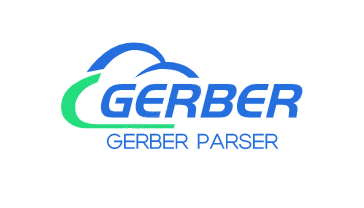
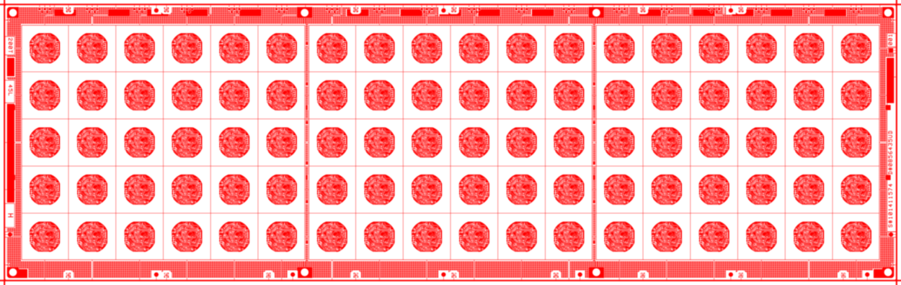

# Gerber Parser - Open Source Gerber File Parsing and Rendering Library

<div align="center">



[](https://opensource.org/licenses/MIT)
[](https://en.cppreference.com/w/cpp/17)
[](https://github.com/hsiang-lee/gerber-parser)

**High-performance C++ Gerber file parsing and rendering library with separation architecture design between parsing and rendering**

</div>

**[中文版本 (Chinese Version)](README_zh.md)**

## 🎯 Project Features

- **Separation of parsing and rendering**: Core parser is completely decoupled from rendering engine for easy extension and customization
- **Blend2D rendering engine**: Provides a high-performance 2D rendering backend with headless image export
- **High performance**: Optimized parsing algorithms and memory management
- **Cross-platform**: Blend2D-based, supports Linux natively. Need Windows/macOS? [Contact us](mailto:leehsiang@hotmail.com) for paid cross-platform support.

## 💝 Support the Project

<div align="center">

| | |
|---|---|
| 🚀 | **This project saves you weeks of Gerber parsing development.** |
| 💰 | Your donation directly funds feature development and maintenance. |

<br>

[](https://www.paypal.com/ncp/payment/3ZRR9DFDYY3R8)

<br>

**⭐ Star this project** · **🐛 Submit Issues** · **📖 Improve docs** · **🔄 Share with others**

</div>

## 📸 Rendering Examples

<div align="center">

### Gerber File Rendering Effect


*Gerber file parsing and rendering effect demonstration*

</div>

## 🏗️ Project Architecture

### Core Modules

```
src/
├── parser/                     # Gerber file parser
│   └── src/
│       ├── gerber_parser/      # Parser core implementation
│       ├── engine/             # Parser engine interface
│       └── parser/             # Various Gerber code parsers
└── engines/                    # Rendering engines
    ├── engine_common.h         # Shared engine constants
    └── blend2d_engine.cpp/h    # Blend2D rendering engine
```

### Parser Features

- Supports complete Gerber file format (RS-274X)
- Parses various aperture types: circular, rectangular, polygonal, elliptical, macro-defined
- Supports G codes, D codes, M codes, and other Gerber commands
- Provides bounding box calculation and coordinate transformation
- Error handling and logging

### Rendering Engine Features

- **Blend2D engine**: Headless rendering, PNG export via built-in codec
- Extensible rendering interface, easy to add new rendering backends

## 🚀 Quick Start

### System Requirements

- CMake 3.20+
- C++17 compatible compiler (GCC 7+, Clang 5+, MSVC 2019+)
- vcpkg (set the `VCPKG_ROOT` environment variable)
- Blend2D (via vcpkg manifest, see vcpkg.json)

All dependencies are installed automatically by the vcpkg manifest — no manual submodule initialization required.

### Build the Project

```bash
# Prerequisite: install vcpkg and set the VCPKG_ROOT environment variable
git clone https://github.com/hsiang-lee/gerber-parser.git
cd gerber-parser
cmake --preset default        # vcpkg manifest auto-installs blend2d/gtest/gflags
cmake --build --preset default
```

### Run Examples

The project provides one example program:

#### 1. Gerber to Image Tool

```bash
# Convert Gerber file to PNG image
./build/example/gerber2image/gerber2image --gerber_file="path/to/gerber/file" --um_pixel=5
```

The output PNG is written next to the input file as `<input file>.png`.

## 📖 API Usage Examples

### C++ API

```cpp
#include <blend2d.h>
#include "gerber_parser/gerber_parser.h"
#include "engines/blend2d_engine.h"

// Parse Gerber file
auto parser = std::make_shared<GerberParser>("path/to/gerber/file");
auto gerber = parser->GetGerber();

// Get bounding box information
const auto& bbox = gerber->GetBBox();
std::cout << "Width: " << bbox.Width() << " Height: " << bbox.Height() << std::endl;

// Render using Blend2D and export to PNG
BLImage image(800, 600, BL_FORMAT_PRGB32);
Blend2DEngine engine(image, bbox, 0.05);
engine.DrawBackground();
const int ret = engine.RenderGerber(gerber);
if (ret != 0) return ret;
image.writeToFile("output.png");
```

## 🔧 Development Guide

### Add a New Rendering Engine

1. Inherit from the `Engine` base class
2. Implement the `RenderGerber` method
3. Add new engine files in the `src/engines/` directory
4. No CMakeLists.txt changes needed (CMake GLOB automatically collects `engines/*.cpp`, and the `gerber_engine` target already links `blend2d::blend2d`)

### Extend Parser Functionality

1. Add new parsers in the `src/parser/gerber_parser/` directory
2. Implement the corresponding parsing logic
3. Update the parser factory class

## 🧪 Testing

The project includes a complete test suite:

```bash
# Configure and build (tests enabled by default preset)
cmake --preset default && cmake --build --preset default

# Run tests
ctest --preset default   # or: ctest --test-dir build
```

Test inputs live in `tests/test_data/gerber/gerber_files/`, and the golden references are 19 Blend2D-rendered PNGs under `tests/test_data/gerber/results/`. Comparisons use a tolerance-based image diff (not strict per-pixel equality).

## 🤝 Contribution Guide

We welcome all forms of contributions! Please refer to the following steps:

1. Fork this project
2. Create a feature branch (`git checkout -b feature/AmazingFeature`)
3. Commit your changes (`git commit -m 'Add some AmazingFeature'`)
4. Push to the branch (`git push origin feature/AmazingFeature`)
5. Create a Pull Request

### Code Standards

- Follow the .clang-format configuration in the project
- Use meaningful variable and function names
- Add appropriate comments and documentation
- Ensure all tests pass

## 📄 License

This project is licensed under the MIT License - see the [LICENSE](LICENSE) file for details.

## 🙏 Acknowledgments

Thanks to the following open source projects for their support:

- [Blend2D](https://blend2d.com/) - High-performance 2D rendering library (Zlib license)
- [Google Test](https://github.com/google/googletest) - C++ testing framework
- [gflags](https://github.com/gflags/gflags) - Command line argument parsing

## 📞 Contact Information

- Project homepage: https://github.com/hsiang-lee/gerber-parser.git
- Issues: https://github.com/hsiang-lee/gerber-parser/issues
- Email: leehsiang@hotmail.com

---

<div align="center">

**Gerber Parser** - Making PCB file processing easier!

</div>