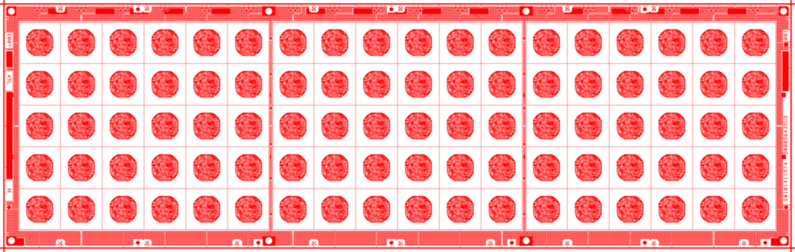

# Gerber Parser - 开源Gerber文件解析与渲染库

<div align="center">


[](https://opensource.org/licenses/MIT)
[](https://en.cppreference.com/w/cpp/17)
[](https://www.qt.io/)
[](https://github.com/your-repo/gerber-parser)

**高性能的C++ Gerber文件解析和渲染库，采用解析与渲染分离的架构设计**

</div>

## 🎯 项目特色

- **解析与渲染分离**：核心解析器与渲染引擎完全解耦，便于扩展和定制
- **多渲染引擎支持**：提供QPainter和QGraphicsScene两种渲染后端
- **高性能**：优化的解析算法和内存管理
- **跨平台**：基于Qt框架，支持Windows、Linux、macOS
- **Python绑定**：通过pybind11提供完整的Python接口

## 💝 支持项目

如果这个项目对您有帮助，请考虑支持我们的开发工作。您的支持将帮助我们持续改进项目：


**扫描上方二维码进行捐赠** 或通过其他方式支持：
- ⭐ **Star这个项目** - 让更多人看到
- 🐛 **提交Issue** - 报告问题或建议功能
- 📖 **完善文档** - 帮助改进使用指南
- 🔄 **分享给其他开发者** - 传播开源精神

## 📸 渲染示例

<div align="center">

### Gerber文件渲染效果


*Gerber文件解析和渲染效果展示*

</div>

## 🏗️ 项目架构

### 核心模块

```
src/
├── parser/           # Gerber文件解析器
│   ├── gerber_parser/ # 解析器核心实现
│   ├── engine/       # 解析引擎接口
│   └── parser/       # 各种Gerber代码解析器
├── engines/          # 渲染引擎
│   ├── qpainter_engine.cpp/h    # QPainter渲染引擎
│   ├── qgraphics_scene_engine.cpp/h # QGraphicsScene渲染引擎
│   └── transformation.cpp/h     # 坐标变换工具
└── pygerber-parser/  # Python绑定
```

### 解析器特性

- 支持完整的Gerber文件格式（RS-274X）
- 解析各种孔径类型：圆形、矩形、多边形、椭圆形、宏定义
- 支持G代码、D代码、M代码等Gerber指令
- 提供边界框计算和坐标变换
- 错误处理和日志记录

### 渲染引擎特性

- **QPainter引擎**：轻量级，适合图像导出和简单显示
- **QGraphicsScene引擎**：功能丰富，支持交互式查看和编辑
- 可扩展的渲染接口，便于添加新的渲染后端

## 🚀 快速开始

### 系统要求

- CMake 3.20+
- C++17兼容编译器（GCC 7+, Clang 5+, MSVC 2019+）
- Qt 6.0+
- Python 3.6+（可选，用于Python绑定）

### 构建项目

```bash
# 克隆项目
git clone https://github.com/hsiang-lee/gerber-parser.git
cd gerber-parser

# 初始化子模块
git submodule update --init --recursive

# 创建构建目录
mkdir build && cd build

# 配置项目
cmake .. -DCMAKE_BUILD_TYPE=Release

# 编译
make -j$(nproc)
```

### 运行示例

项目提供了多个示例程序：

#### 1. Gerber转图像工具

```bash
# 将Gerber文件转换为PNG图像
./example/gerber2image/gerber2image --gerber_file="path/to/gerber/file" --um_pixel=5
```

#### 2. Gerber查看器

```bash
# 启动交互式Gerber文件查看器
./example/gerber_viewer/gerber_viewer
```

#### 3. QGraphicsScene查看器

```bash
# 使用QGraphicsScene的查看器
./example/gerber_viewer_qgraphics/gerber_viewer_qgraphics
```

## 📖 API使用示例

### C++ API

```cpp
#include "gerber_parser/gerber_parser.h"
#include "engines/qpainter_engine.h"

// 解析Gerber文件
auto parser = std::make_shared<GerberParser>("path/to/gerber/file");
auto gerber = parser->GetGerber();

// 获取边界框信息
const auto& bbox = gerber->GetBBox();
std::cout << "Width: " << bbox.Width() << " Height: " << bbox.Height() << std::endl;

// 使用QPainter渲染
QPixmap image(800, 600);
auto engine = std::make_unique<QPainterEngine>(&image, bbox, 0.05);
engine->RenderGerber(gerber);
image.save("output.png");
```

### Python API

```python
import pygerber_parser
import numpy as np
from PIL import Image

# 方法1: 使用函数式API
image_data = pygerber_parser.gerber2image("path/to/gerber/file", 800, 600)

# 转换为PIL图像
arr = np.array(image_data, dtype=np.uint8).reshape((600, 800, 4))
img = Image.fromarray(arr, 'RGBA')
img.save("output.png")

# 方法2: 使用面向对象API
parser = pygerber_parser.GerberParser("path/to/gerber/file")
if parser.is_valid():
    print(f"尺寸: {parser.get_width()} x {parser.get_height()}")
    image_data = parser.render_to_image(800, 600)
    # 处理图像数据...
```

详细Python使用指南请参考 [PYTHON_USAGE.md](PYTHON_USAGE.md)

## 🔧 开发指南

### 添加新的渲染引擎

1. 继承`RenderEngine`基类
2. 实现`RenderGerber`方法
3. 在`engines/`目录中添加新的引擎文件
4. 更新CMakeLists.txt文件

### 扩展解析器功能

1. 在`src/parser/gerber_parser/`目录中添加新的解析器
2. 实现相应的解析逻辑
3. 更新解析器工厂类

## 🧪 测试

项目包含完整的测试套件：

```bash
# 启用测试构建
cmake .. -DBUILD_TESTS=ON

# 运行测试
make test
```

测试数据位于`tests/test_data/gerber/`目录中。

## 🤝 贡献指南

我们欢迎各种形式的贡献！请参考以下步骤：

1. Fork本项目
2. 创建特性分支 (`git checkout -b feature/AmazingFeature`)
3. 提交更改 (`git commit -m 'Add some AmazingFeature'`)
4. 推送到分支 (`git push origin feature/AmazingFeature`)
5. 创建Pull Request

### 代码规范

- 遵循项目中的.clang-format配置
- 使用有意义的变量和函数名
- 添加适当的注释和文档
- 确保所有测试通过

## 📄 许可证

本项目采用MIT许可证 - 详见[LICENSE](LICENSE)文件。

## 🙏 致谢

感谢以下开源项目的支持：

- [Qt](https://www.qt.io/) - 跨平台应用框架
- [pybind11](https://github.com/pybind/pybind11) - Python绑定生成器
- [Google Test](https://github.com/google/googletest) - C++测试框架
- [gflags](https://github.com/gflags/gflags) - 命令行参数解析

## 📞 联系方式

- 项目主页：https://github.com/hsiang-lee/gerber-parser.git
- Issues：https://github.com/hsiang-lee/gerber-parser/issues
- 邮箱：leehsiang@hotmail.com

---

<div align="center">

**Gerber Parser** - 让PCB文件处理变得更简单！

</div>