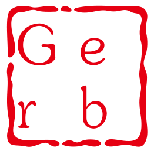
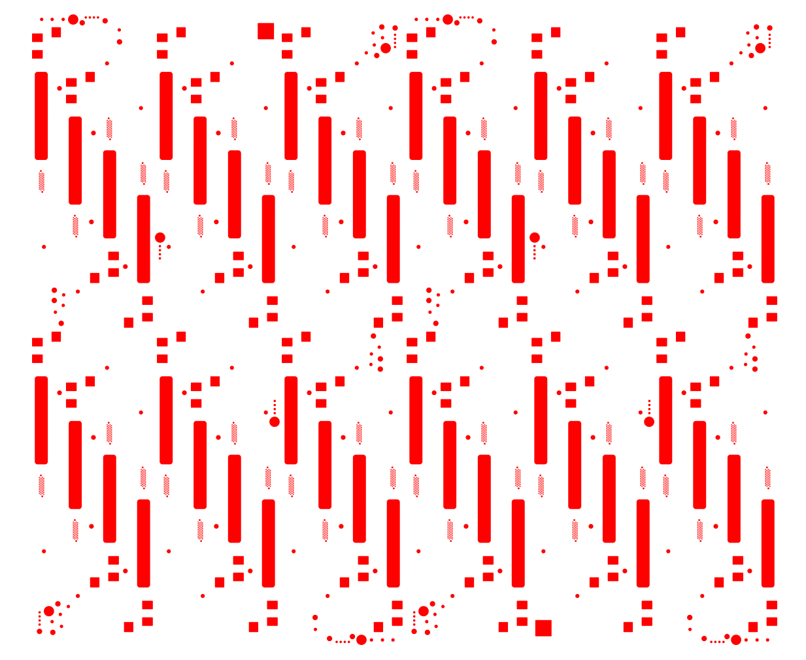

[简体中文](./ReadMe_simple_chinese.md)

# GerberRenderer

[](https://github.com/hsiang-lee/gerber_render/actions/workflows/macos.yml)
[](https://github.com/hsiang-lee/gerber_render/actions/workflows/ubuntu.yml)
[](https://github.com/hsiang-lee/gerber_render/actions/workflows/windows.yml)


GerberRenderer is an open source, cross-platform compilation, easy-to-use Gerber file rendering library, written in standard C++, and supports the rs274x standard. The rendering engine is written in Qt and supports rendering Gerber files to the image export format supported by Qt:


Format|Description|Qt's support
---|:--:|---:
BMP|Windows Bitmap|Read/write
GIF|Graphic Interchange Format (optional)|Read
JPG|Joint Photographic Experts Group|Read/write
JPEG|Joint Photographic Experts Group|Read/write
PNG|Portable Network Graphics|Read/write
PBM|Portable Bitmap|Read
PGM|Portable Graymap|Read
PPM|Portable Pixmap|Read/write
XBM|X11 Bitmap|Read/write
XPM|X11 Pixmap|Read/write

also supports rendering directly to the QWidget window.

In addition, Qt also provides QSvgGenerator and QPdfWriter, which inherits from QPaintDevice. Theoretically, it can also be rendered into sgv and pdf to export, but there is no direct support currently.

In addition to rendering and exporting static images, the GerberRenderer library also supports some interactive operations. For example, move the position of the image, zoom the image and highlight a certain point. These functions can be used for interactive Gerber display, refer to example/gerber_viewer. It can also be used for segmented rendering and export of larger images, example/gerber2image provides an example. For images with higher resolution, exporting into one image will be subject to many restrictions. Example/gerber2image is exported into multiple images through segmented export, each with a maximum resolution of 20000, which together form a complete image.


# Supported platform
Gerber Render is written in standard C++, and the dependent Qt5, glog, and gflags all support cross-platform compilation. It has been tested to compile normally on Linux, Mac and Windows.


# Sample image



# How to build?

## Dependent libraries：
- Qt(Higher version may also supported, but not tested)
- glog(Used for logging)
- gflags(The sample program used to parse the cui parameter, if you turn off the "BUILD_EXAMPLE" option, this dependency is not needed)
- googletest(For unit test, this dependency is not needed if the option "BUILD_TESTS" is turned off)
Qt5 needs to be installed externally. Specify the Qt installation path when CMake, or set the Qt installation path through CMake-GUI, or set the environment variables of Qt on the machine.
glog, gflags, and googletest have been self-contained through git submodules and do not need to be provided externally.


## Clone：
```
git clone https://github.com/hsiang-lee/gerber_renderer
git submodule update --recursive --init
```


## CMake:
```
cd gerber_render
mkdir build
cd build
cmake .. -G "NMake Makefiles" -DBUILD_EXAMPLES=OFF -DBUILD_TESTS=ON -DBUILD_TESTING=OFF -DBUILD_SHARED_LIBS=OFF -DQt5_DIR=path/of/Qt
```


## Build:
Linux(Ubuntu) or Mac:
```make```

Windows:
```nmake```


# How to use？
```
auto gerber = std::make_shared<Gerber>(gerber_file_path);//Construct a Gerber object，gerber file will be parsed here。

auto image = std::make_unique<QBitmap>(1920， 1280);//Create a QBitmap(for export bitmap image).Other images can also be exported, eg: QPixmap or QImage. 
auto engine = std::make_unique<QtEngine>(image.get());//Construct a QtEngine
GerberRender render(engine.get());//Construct a GerberRender
render.RenderGerber(gerber);//Render the gerber file to a bitmap image created above

image->save(path_you_want_to_save_image);//Save the image rendered to file.
```


# Tools
GerberRenderer also includes some simple tools, which are in the example directory. When CMake, set BUILD_EXAMPLES=ON to build these tools.
* gerber_viewer	A simple gerber preview tool that can zoom, drag, and select elements (Not fully supported yet)
* gerber2image	A tool for exporting gerber files to binary bitmaps, providing a cui interface, and you can get helps from the "--help" option
* gerber2svg	A tool for exporting gerber files to svg images, providing a cui interface, and you can get helps from the "--help" option
