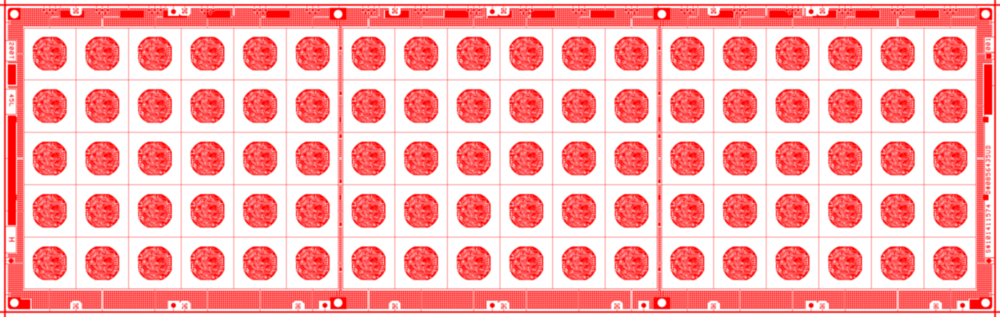

<h1 align="center">Welcome to GerberParser 👋</h1>


[English](./ReadMe_English.md)

<p>
  
  <a href="https://github.com/hsiang-lee/gerber-parser" target="_blank">
    
  </a>
  <a href="https://github.com/hsiang-lee/gerber-parser/blob/master/LICENSE" target="_blank">
    
  </a>

[](https://github.com/hsiang-lee/gerber-parser/actions/workflows/macos.yml)
[](https://github.com/hsiang-lee/gerber-parser/actions/workflows/ubuntu.yml)
[](https://github.com/hsiang-lee/gerber-parser/actions/workflows/windows.yml)
</p>

GerberParser是一个gerber文件解析库。它采用标准c++编写，支持rs274x标准。良好支持跨平台编译，目前在MacOS、Linux和Windows上编译、测试通过。它使用Qt绘图引擎来绘制，支持直接绘制到Qt的Widget上，也支持绘制到图像上。Qt支持的图像格式都支持，包括BMP、GIF、JPEG、PNG等。下面是一个支持的图像格式的列表。

Format|Description|Qt's support
---|:--:|---:
BMP|Windows Bitmap|Read/write
GIF|Graphic Interchange Format (optional)|Read
JPG|Joint Photographic Experts Group|Read/write
JPEG|Joint Photographic Experts Group|Read/write
PNG|Portable Network Graphics|Read/write
PBM|Portable Bitmap|Read
PGM|Portable Graymap|Read
PPM|Portable Pixmap|Read/write
XBM|X11 Bitmap|Read/write
XPM|X11 Pixmap|Read/write

另外，Qt也提供了QSvgGenerator和QPDFWriter，这两个类都继承自QPainterDevice。通过Qt的这些支持，你也可以将gerber文件绘制到svg格式的图像或pdf格式的文件中。

仓库example目录下提供了两个demo程序。一个用来将gerber文件导出成图像文件。支持超高分辨率的导出，对于低分辨率的会导出成一个文件，对于高分辨率(分辨率高到超出了限制)的，会自动切割，导出成多个片段。另外一个是gerber_viewer，它是一个交互式的界面程序，用来预览gerber文件，支持简单的放大缩小的交互。如果你想编译example程序，请在CMake时加上"BUILD_EXAMPLES"的选项。

### 渲染样图


### ✨ [Demo](https://github.com/hsiang-lee/gerber-parser/tree/master/example)

## 安装
### 依赖的第三方库：
- Qt(我使用的是5.12的版本，其他版本理论上也支持，不过没有测试过)
- glog(用于记录日志)
- gflags(示例程序中使用，用来解析参数)
- googletest(用于单元测试，默认是关闭的)
Qt5需要另外安装，在CMake时需要制定Qt的路径(如果Qt的路径已经加入好环境变量里了，CMake应该能自己找到)
glog, gflags, and googletest已经添加到git的submodule中了。第一次拉代码时，执行"git submodule update --init --recursive"会自动拉取子模块的代码。

### 克隆代码：
```
git clone https://github.com/hsiang-lee/gerber-parser
git submodule update --recursive --init
```

### CMake:
```
cd gerber-parser
mkdir build
cd build
cmake .. -G "NMake Makefiles" -DBUILD_EXAMPLES=OFF -DBUILD_TESTS=OFF -DBUILD_TESTING=OFF -DBUILD_SHARED_LIBS=OFF -DQt5_DIR=path/of/Qt
```

### 构建:
Linux(Ubuntu) or Mac:
```make```

Windows:
```nmake```

## 使用示例
```
auto parser = std::make_shared<GerberParser>(gerber_file_path);
auto gerber = parser->GetGerber();
//Construct a Gerber object，gerber file will be parsed here。

auto image = std::make_unique<QBitmap>(1920， 1280);//Create a QBitmap(for export bitmap image).Other images can also be exported, eg: QPixmap or QImage.
auto engine = std::make_unique<QPainterEngine>(image.get());//Construct a QtEngine
engin->RenderGerber(gerber);//Render the gerber file to a bitmap image created above

image->save(path_you_want_to_save_image);//Save the image rendered to file.
```
也可参考example中的代码。

## 关于作者

👤 **leehsiang**

* Website: https://www.cnblogs.com/leehsiang
* Github: [@hsiang-lee](https://github.com/hsiang-lee)
* Wechat: 

## 🤝 贡献代码

欢迎提交issue或功能请求 <br />Feel free to check [issues page](https://github.com/hsiang-lee/gerber-parser/issues). You can also take a look at the [contributing guide](https://github.com/hsiang-lee/gerber-parser).

## 支持作者

记得点赞，给星⭐️ 哟~

### Stargazers
[](https://github.com/hsiang-lee/gerber-parser/stargazers)

### Forkers
[](https://github.com/hsiang-lee/gerber-parser/network/members)

## 📝 License

Copyright © 2022 [leehsiang](https://github.com/hsiang-lee).<br />
This project is [MIT license](https://github.com/hsiang-lee/gerber-parser/blob/master/LICENSE) licensed.
